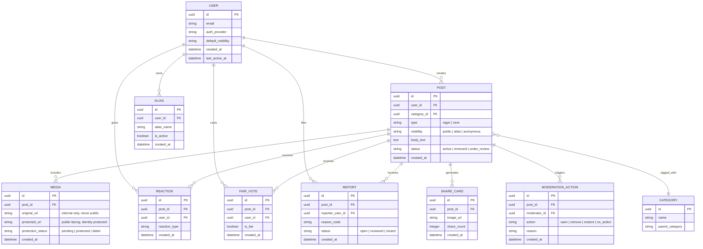

# Ragers — Data Model / Schema Diagram

**Classification:** Internal — do not publish or link from public surfaces.

This is the core relational data model behind Ragers, covering the entities needed for posting, reacting, reporting, and moderation. It intentionally omits any proprietary scoring/ranking internals (trust-score calculation, moderation-routing logic) — those live in separate internal architecture docs, not here. A rendered version of this diagram is in `schema-diagram.svg`.

## Entity-relationship diagram

## Notes

- `MEDIA.original_url` is never exposed on any public API response or public page — only `protected_url` (post identity-protection processing) is public-facing. This maps directly to the "Identity Protected" promise on the landing page.
- `POST.visibility = anonymous` means no `user_id` is exposed in any public API response for that post, even though the row retains it internally for moderation/abuse purposes.
- `ALIAS` is separate from `USER` so a user can maintain more than one alias, each with its own posting history, without those histories being publicly linkable to each other or to the underlying account.
- `MODERATION_ACTION` and the internal fields on `REPORT`/`MEDIA` are examples of exactly the kind of implementation detail that must stay out of public copy — see `CLAUDE.md`.
- This model deliberately excludes any proprietary scoring/weighting fields (e.g. how `FAIR_VOTE` and `REACTION` data feed into any internal trust or ranking system) — that logic is out of scope for this document and lives in internal architecture material.
